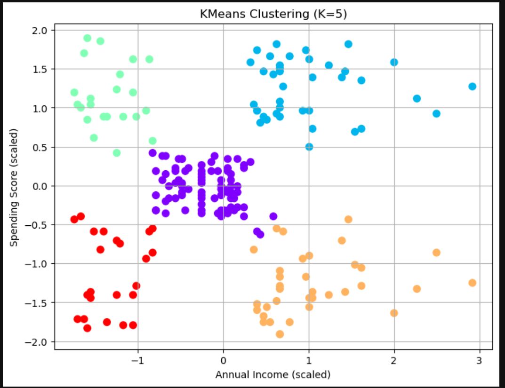
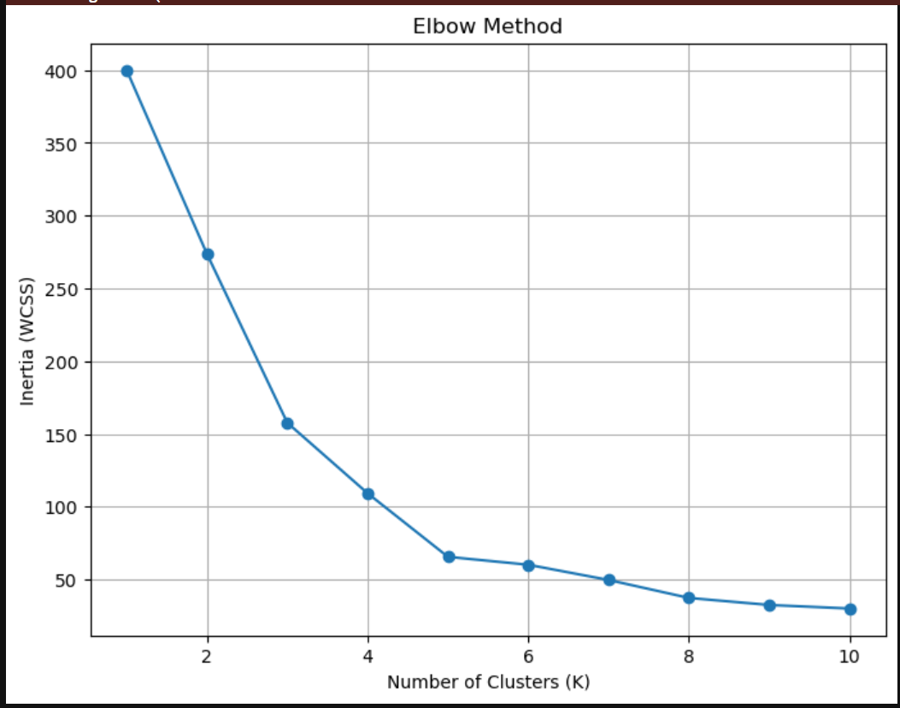

# Customer Segmentation – KMeans Clustering (Task 8)

## Task Objective  
Cluster mall customers based on spending habits and income using KMeans. Identify optimal clusters using the elbow method and evaluate cluster quality with Silhouette Score (unsupervised learning with K-Means clustering).

## 🔧 Tools Used  
- Python  
- Pandas  
- Scikit-learn  
- Matplotlib  
- StandardScaler

## ⚙️ What I Did

1. **Loaded and explored the dataset**  
   - Dropped `CustomerID` column  
   - Encoded `Gender` column using `.map()`  
   - Selected features: `Annual Income` and `Spending Score`

2. **Scaled the features**  
   - Used `StandardScaler()` to normalize the data  
   - Necessary for distance-based clustering like KMeans

3. **Trained KMeans model**  
   - Started with `n_clusters=5`  
   - Used `.fit()` and `.labels_` to assign clusters  
   - Visualized results with `scatter()` and colored clusters

4. **Used Elbow Method**  
   - Plotted `inertia_` vs. K from 1 to 10  
   - Found optimal value at **K = 5**

5. **Evaluated with Silhouette Score**  
   - Used `silhouette_score()`  
   - Score = **0.55**, which indicates good clustering structure

## 📷 Screenshots

-  – Cluster plot with K=5  
-  – Inertia vs. number of clusters  
-  – Final evaluation score

## 📁 Files in this Repo

- `kmeans_clustering.ipynb` – Notebook with code and results  
- `README.md` – This file  
- `Mall_Customers.csv` – Dataset 
- Screenshots – For clustering, elbow plot, silhouette score
